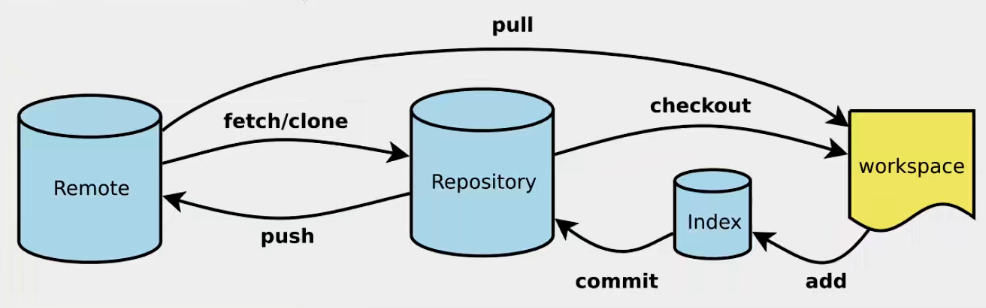

# Markdown Notes

# 一级标题

## 二级标题

### 三级标题

#### 四级标题

##### 五级标题

###### 六级标题

---

## 1.常用

**加粗**


  *斜体*
  

***加粗斜体***


~~删除线~~

H~2~O is是液体。

2^10^ 运算结果是 1024.

---
## 2.引用和代码段

> 这是一个引用片段！

``` text

纯文本|代码片段

```

[link](https://www.baidu.com)




---


## 3.列表

+ 无序列表
+ 无序列表
+ 无序列表

1. 有序列表
2. 有序列表
3. 有序列表

---

## 4.表格

标题11111111|标题22222222|标题33333333
:---|:---:|---:
左对齐 | 居中对齐 | 右对齐 
单元格 | 单元格 | 单元格 

---

## 5.段落

第一个正常段 落正常段落正常段落正常段落正常段落正常段落正常段落正常段落正常段落

第二个正常段落 正常段落正常段落正常段落正常段落正常段落阿斯顿
